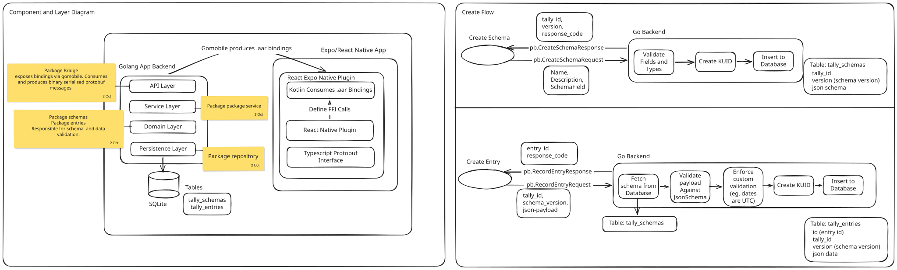

# Tally

Tally is a local, schema-enforced personal data engine for tracking literally anything. 

Tally allows users to define and record custom trackers (or Tallies) such as a "Reading Tracker" with fields like "book name" and "pages read".

<p float="left">


</p>

UI: Expo (React Native) + react-native-paper
Backend: Go + SQLite, compiled into native libraries via gomobile
Bridge: Binary Protobuf over FFI (Kotlin JNI for Android)

<details open>
<summary><h3>Architecture</h3></summary>

This project is built as an Android app with a Golang backend owning an SQLite
database (with 2 tables), and an Expo / React Native frontend. The communication
between the Go app and React are done through a React Native Plugin consuming
JNI bindings generated using `gomobile`. To ensure predictability and
type-safety through language boundries, communications are defined using
protobuf, and passed through as serialised binary.



</details>

<details>
<summary><h3>CLI demo</h3></summary>

```sh
$ tally schema list
> No tally schemas found.

$ tally schema create -n 'Reading Tracker' \
    -m 'Tracking reading habits' \
    -f 'book:which book was read:string:true' \
    -f 'pages:pages read:integer:true' \
    -f 'time:time when reading started:date-time:true'

> Created schema for 'Reading Tracker' (3JyNWHK6JYV1TE5ufVpssbYxFe8, v1):
> {
>   "tally_id": "3JyNWHK6JYV1TE5ufVpssbYxFe8",
>   "version": 1,
>   "name": "Reading Tracker",
>   "description": "Tracking reading habits",
>   "json_schema": "{\"type\":\"object\",\"properties\":{\"book\":{\"type\":\"string\",\"title\":\"book\",\"description\":\"which book was read\"},\"pages\":{\"type\":\"integer\",\"title\":\"pages\",\"description\":\"pages read\"},\"time\":{\"type\":\"string\",\"title\":\"time\",\"description\":\"time when reading started\",\"format\":\"date-time\"}},\"description\":\"Tracking reading habits\",\"required\":[\"book\",\"pages\",\"time\"],\"additionalProperties\":false}",
>   "created_at": "2026-09-28T21:02:57Z"
> }

$ tally schema list
> TALLY ID                      VERSION   NAME              CREATED AT             SCHEMA
> ---------------------------------------------------------------------------------------
> 3JyNWHK6JYV1TE5ufVpssbYxFe8   v1        Reading Tracker   2026-09-28T21:02:57Z   {"type":"object","properties":{"book":{"type":"string","title":"book","description":"which book was ...

$ tally entry list -t 3JyNWHK6JYV1TE5ufVpssbYxFe8
> No entries found for tally '3JyNWHK6JYV1TE5ufVpssbYxFe8'.

$ tally entry add -t 3JyNWHK6JYV1TE5ufVpssbYxFe8 -d "{\"book\":\"The Stranger\", \"pages\": 20, \"time\":\"$(date -Iseconds)\"}"
> Logged entry 3JyNe04LnhADzOT2Y1SspRXGmHh for tally '3JyNWHK6JYV1TE5ufVpssbYxFe8' (v1) at 2026-09-28 21:03:59

$ tally entry list -t 3JyNWHK6JYV1TE5ufVpssbYxFe8
> ENTRY ID                      VERSION   CREATED AT             UPDATED_AT             DATA
> ------------------------------------------------------------------------------------------
> 3JyNe04LnhADzOT2Y1SspRXGmHh   v1        2026-09-28T21:03:59Z   -                      {"book":"The Stranger", "pages": 20, "time":"2026-09-28T22:03:59+01:00"}

$ tally entry add -t 3JyNWHK6JYV1TE5ufVpssbYxFe8 -d "{\"book\":\"The Fall\", \"pages\": 23, \"time\":\"$(date -Iseconds)\"}"
> Logged entry 3JyNicKBXFY9ZMW3wQc5BcpaE3Q for tally '3JyNWHK6JYV1TE5ufVpssbYxFe8' (v1) at 2026-09-28 21:04:35

$ tally entry add -t 3JyNWHK6JYV1TE5ufVpssbYxFe8 -d "{\"book\":\"The Fall\", \"pages\": 23, \"time\":\"$(date -Iseconds)\", \"review\":\"good\"}"
> Error: failed to log entry: entry domain creation failed: failed to validate entry data: entry validation failed: validating root: unexpected additional properties ["review"]

$ tally entry patch -t 3JyNicKBXFY9ZMW3wQc5BcpaE3Q -d "{\"pages\": 45}"
> Patched entry 3JyNicKBXFY9ZMW3wQc5BcpaE3Q for tally '3JyNWHK6JYV1TE5ufVpssbYxFe8' (v1) at 2026-09-28 21:04:35

$ tally entry list -t 3JyNWHK6JYV1TE5ufVpssbYxFe8
> ENTRY ID                      VERSION   CREATED AT             UPDATED_AT             DATA
> ------------------------------------------------------------------------------------------
> 3JyNicKBXFY9ZMW3wQc5BcpaE3Q   v1        2026-09-28T21:04:35Z   2026-09-28T21:06:09Z   {"book":"The Fall","pages":45,"time":"2026-09-28T22:04:35+01:00"}
> 3JyNe04LnhADzOT2Y1SspRXGmHh   v1        2026-09-28T21:03:59Z   -                      {"book":"The Stranger", "pages": 20, "time":"2026-09-28T22:03:59+01:00"}
```

</details>

<details>
<summary><h3>Expansion Details</h3></summary>

To expand the capabilities of the Go/Typescipt bridge you must follow these steps:

1 .Define your new request and response payloads in service.proto:
```proto
message NewFeatureRequest {
  string tally_id = 1;
}

message NewFeatureResponse {
  ResponseCode code = 1;
  string error_message = 2;
}
```

2. Run code generation to update both Go and TypeScript Protobuf bindings:
```bash
just generate
```

3. Implement domain logic (`service.go`) using domain data:
```go
func (s *Service) NewFeature(ctx context.Context, req NewFeatureRequest) ( error) {
    // ... DB / Business logic
    return nil
}
```

4. Expose FFI Export (`bridge.go`)
```go
func NewFeature(reqBytes []byte) []byte {
    // ...
    return respBytes
}
```

5. Rebuild Native Libraries (gomobile)
```bash
just bind
```

6. Register Native Async Function (Kotlin)
Expose the new bridge function inside the Expo module definition:
```kotlin
// apps/tally/modules/tally-backend/android/src/main/java/expo/modules/tallybackend/TallyBackendModule.kt
AsyncFunction("newFeature") { reqBytes: ByteArray ->
    Bridge.newFeature(reqBytes)
}
```

7. Update TypeScript Module Interface
```ts
// apps/tally/modules/tally-backend/src/TallyBackendModule.ts
declare class TallyBackendModule extends NativeModule<{}> {
  listEntries(reqBytes: Uint8Array): Promise<Uint8Array>;
  newFeature(reqBytes: Uint8Array): Promise<Uint8Array>;
}
```


6. Register the new function's signature in the native-module:
```ts
// apps/tally/modules/tally-backend/src/TallyBackendModule.ts
declare class TallyBackendModule extends NativeModule<{}> {
    listEntries(reqBytes: Uint8Array): Promise<Uint8Array>;
    /// ...
    newFeature(reqBytes: Uint8Array): Promise<Uint8Array>;
}

```

7. Implement the new function with the generated typescript proto stub:
```ts
// apps/tally/modules/tally-backend/index.ts
import { create, toBinary, fromBinary, type Init } from '@bufbuild/protobuf';
import {
  NewFeatureRequestSchema,
  NewFeatureResponseSchema,
  type NewFeatureResponse,
} from '../../generated/tally/v1/service_pb';
import TallyBackendModule from './src/TallyBackendModule';

export async function newFeature(
  request: Init<typeof NewFeatureRequestSchema>
): Promise<NewFeatureResponse> {
  const msg = create(NewFeatureRequestSchema, request);
  const reqBytes = toBinary(NewFeatureRequestSchema, msg);
  const respBytes = await TallyBackendModule.newFeature(reqBytes);
  return fromBinary(NewFeatureResponseSchema, respBytes);
}
```
</details>

## Acknowledgement

- https://medium.com/@ykanavalik/how-to-run-golang-code-in-your-react-native-android-application-using-expo-go-d4e46438b753
- https://docs.expo.dev/modules/native-module-tutorial
- https://github.com/siddarthkay/react-native-go/tree/master
